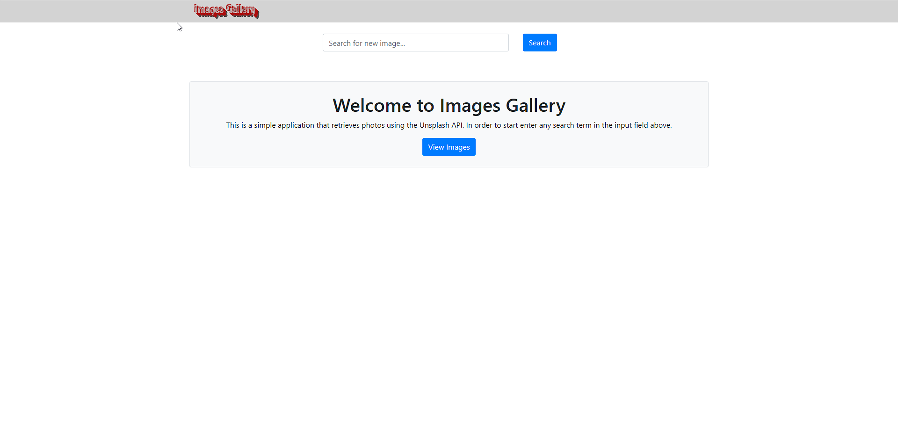
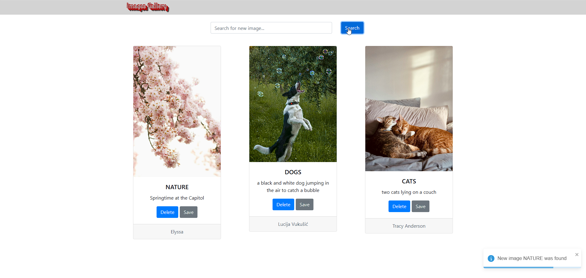
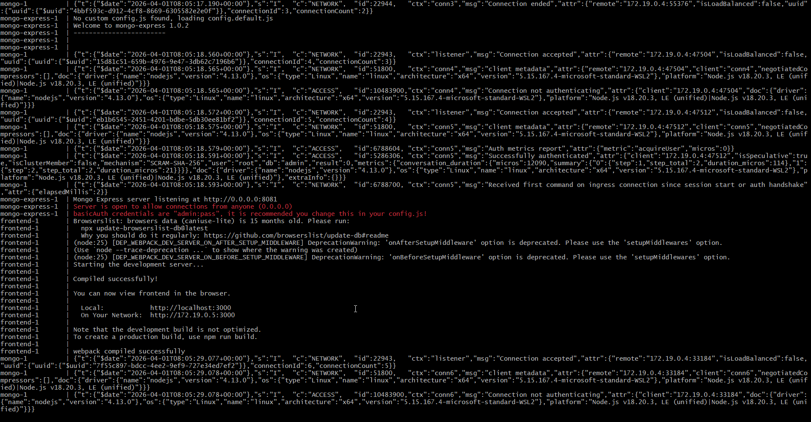

📸 Images Gallery
A full‑stack image search application built with React, Flask, MongoDB, and the Unsplash API.
The app allows users to search for images in real time and displays results in a responsive gallery UI.
All services are fully containerized using Docker.

🚀 Features
🔍 Real‑time image search using the Unsplash API

🖼 Responsive gallery layout built with React

⚡ Flask backend that proxies API requests

🗄 MongoDB integration for storing search history

🐳 Dockerized architecture (frontend, backend, database)

🔗 Clean separation between UI, API, and data layers

🏗 Tech Stack
Frontend
React

JavaScript

Webpack Dev Server

Backend
Python

Flask

Flask‑CORS

Requests

Database
MongoDB

Infrastructure
Docker

Docker Compose

External API
Unsplash API

📂 Project Structure
Код
images-gallery/
frontend/ → React UI
api/ → Flask backend
docker-compose.yml
README.md
📸 Screenshots
Replace the placeholders below with your actual image paths after uploading them to the repository.

🔹 Home Screen

🔹 Search Results

🔹 Docker & API Running

🧪 Running the Project

1. Add your Unsplash API key
   Create a file in the backend folder:

Код
api/.env.local
Add:

Код
UNSPLASH_KEY=your_unsplash_key_here 2. Start the application
bash
docker-compose up --build
After startup:

Frontend → http://localhost:3000

Backend → http://localhost:5000

🧱 Architecture Overview
The frontend sends search requests to the Flask backend:

Код
React UI → Flask API → Unsplash API → Flask → React → Gallery
MongoDB stores search history or other metadata depending on configuration.

🎯 What This Project Demonstrates
Full‑stack development skills

REST API integration

Containerized architecture

Clean separation of concerns

Backend routing and data handling

Responsive UI development

📄 License
This project is for educational and portfolio purposes.
